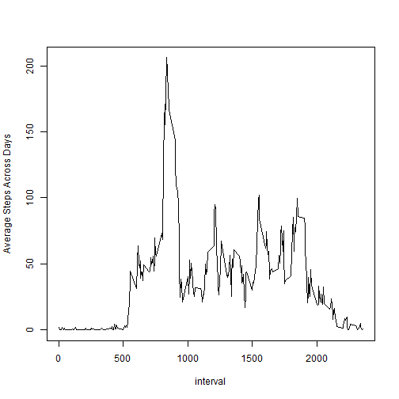

library(dplyr)
library(lubridate)
library(knitr)
library(ggplot2)


## Loading and preprocessing the data


```r
setwd("C:\\Users\\motazel\\OneDrive\\Documents\\Courses\\DataScienceJHUCoursera\\ReproducibleResearch\\repdata_data_activity")
activityData = read.csv("activity.csv")
activityDataDate = as.character(activityData$date)
activityData$date = activityDataDate
```


## What is mean total number of steps taken per day?


```r
by_date <- group_by(activityData,date)
TotalStepsPerDay <- summarize(by_date,SumStepsPerDay = sum(steps, na.rm=TRUE))

hist(TotalStepsPerDay$SumStepsPerDay)
```

 

```r
TotalStepsPerDay %>% summarize(meanSteps = mean(TotalStepsPerDay$SumStepsPerDay,na.rm=TRUE), medianSteps = median(TotalStepsPerDay$SumStepsPerDay,na.rm=TRUE))
```

```
## Source: local data frame [1 x 2]
## 
##   meanSteps medianSteps
## 1   9354.23       10395
```


## What is the average daily activity pattern?


```r
by_Five_min_interval <- group_by(activityData,interval)
AverageSteps_perIntervalAcrossDays <- summarize(by_Five_min_interval,AvgStepsInterval = mean(steps, na.rm=TRUE))

plot(AverageSteps_perIntervalAcrossDays$interval, AverageSteps_perIntervalAcrossDays$AvgStepsInterval, type = "l", xlab="interval", ylab= "Average Steps Across Days")
```

 

```r
indexMax <- which.max(AverageSteps_perIntervalAcrossDays$AvgStepsInterval)
IntervalWithMaxStepsAcrossDays <- AverageSteps_perIntervalAcrossDays[indexMax,1]
#interval with maximum average stpes across days
print(IntervalWithMaxStepsAcrossDays)
```

```
## Source: local data frame [1 x 1]
## 
##   interval
## 1      835
```


## Imputing missing values


#1.Calculate and report the total number of missing values in the dataset (i.e. the total number of rows with NAs)


```r
print(sum(is.na(activityData$steps)==TRUE))
```

```
## [1] 2304
```

#2.Devise a strategy for filling in all of the missing values in the dataset. The strategy does not need to be sophisticated. For example, you could use the mean/median for that day, or the mean for that 5-minute interval, etc.

I will fill in the missing values by the mean of the values per 5-minute interval


```r
by_Five_min_interval <- group_by(activityData,interval)
AverageSteps_perIntervalAcrossDays <- summarize(by_Five_min_interval,AvgStepsInterval = mean(steps, na.rm=TRUE))
```

#3.Create a new dataset that is equal to the original dataset but with the missing data filled in.

```r
indeceswithNAs <- activityData$steps
temp <- activityData[is.na(activityData$steps)==TRUE,1]


activityDataImputed = activityData


for (index in 1:length(indeceswithNAs))
  {
  if(is.na(indeceswithNAs[index]) == TRUE )
    {    
    #impute in this case
    intervalToBeConsidered = activityData[index,3]
    InfoForInterval = filter(AverageSteps_perIntervalAcrossDays, interval == intervalToBeConsidered)
    activityDataImputed[index,1] = InfoForInterval[,2]
    
  }
  
  }
```


#4.Make a histogram of the total number of steps taken each day and Calculate and report the mean and median total number of steps taken per day. Do these values differ from the estimates from the first part of the assignment? What is the impact of imputing missing data on the estimates of the total daily number of steps?


```r
by_date2 <- group_by(activityDataImputed,date)
TotalStepsPerDay2 <- summarize(by_date2,SumStepsPerDay2 = sum(steps, na.rm=TRUE))


hist(TotalStepsPerDay2$SumStepsPerDay2)
```

 

```r
TotalStepsPerDay2 %>% summarize(meanSteps = mean(TotalStepsPerDay2$SumStepsPerDay2,na.rm=TRUE), medianSteps = median(TotalStepsPerDay2$SumStepsPerDay2,na.rm=TRUE))
```

```
## Source: local data frame [1 x 2]
## 
##   meanSteps medianSteps
## 1  10766.19    10766.19
```

The histogram shows quite a difference fromt he case where simply NA rows were discared, mstly the small interval values increased and less effect on the large interval values. Bothe mean and median values moved higher up.

## Are there differences in activity patterns between weekdays and weekends?


```r
#by_Five_min_interval <- group_by(activityDataImputed,interval)
tempDate <- activityDataImputed[,2]
tempDateOSIX <- strptime(tempDate,"%Y-%m-%d")
activityDataImputed$WeekdayCol = weekdays(tempDateOSIX)

#convert to factor based on weekend of weekday
activityDataImputed$WeekEnddayCol_Factor = (activityDataImputed$WeekdayCol == "Saturday") | (activityDataImputed$WeekdayCol == "Sunday")
activityDataImputed$WeekEnddayCol_Factor = factor(activityDataImputed$WeekEnddayCol_Factor)
#rename fatcors to weekend and weekday
#activityDataImputed$WeekEnddayCol_Factor = mapvalues(activityDataImputed$WeekEnddayCol_Factor, from = c("FALSE", "TRUE"), to = c("Weekday", #"Weekend"))

levels(activityDataImputed$WeekEnddayCol_Factor) = c("Weekday", "Weekend")


ResultDF <- activityDataImputed %>% group_by(interval,WeekEnddayCol_Factor) %>% summarize(AvgStepsInterval = mean(steps, na.rm=TRUE))
#AverageSteps_perIntervalAcrossDays <- summarize(by_Five_min_interval,AvgStepsInterval = mean(steps, na.rm=TRUE))


g <- ggplot(ResultDF, aes(interval, AvgStepsInterval))
p = g + geom_line() + facet_wrap(~ WeekEnddayCol_Factor, nrow=2)
print(p)
```

 

